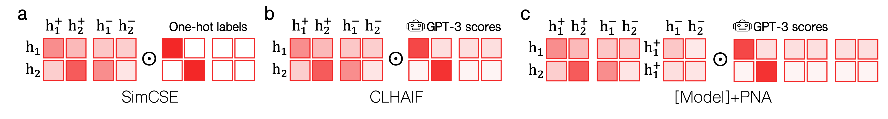

# Capturing the Relationship Between Sentence Triplets for LLM and Human-Generated Texts to Enhance Sentence Embeddings
This is an official repository for implementing our [paper](https://aclanthology.org/2024.findings-eacl.43/), which was accepted to the Findings of EACL 2024.

## Summary
Our proposed training objective, Positive-Negative Augmentation (PNA) loss, enables a sentence embedding model to learn the relationship between positives and negatives, unlike [SimCSE](https://github.com/princeton-nlp/SimCSE) and [CLHAIF](https://github.com/xiami2019/CLAIF). Note that PNA can be applied to any sentence embedding models trained with sentence triplets (references, positives, and negatives).




## Training

```python
if num_sent >= 3:
    z1_z3_cos = cls.sim(z1.unsqueeze(1), z3.unsqueeze(0))
    cos_sim = torch.cat([cos_sim, z1_z3_cos], 1)
    # Augment negative relation between human positive & negative
    z2_z3_cos = cls.sim(z2.unsqueeze(1), z3.unsqueeze(0))
    cos_sim = torch.cat([cos_sim, z2_z3_cos], 1)
```

### SimCSE+PNA

1. Clone [SimCSE](https://github.com/princeton-nlp/SimCSE).
2. cd [SimCSE](https://github.com/xfactlab/eacl2024-pna/blob/main/SimCSE)
3. Change the original [models.py](https://github.com/princeton-nlp/SimCSE/blob/main/simcse/models.py) to new [models.py](https://github.com/xfactlab/eacl2024-pna/blob/main/SimCSE/simcse/models.py).
5. bash [run_sup_example.sh](https://github.com/princeton-nlp/SimCSE/blob/main/run_sup_example.sh)

### CLHAIF+PNA

1. Clone [CLAIF](https://github.com/xiami2019/CLAIF).
2. cd [CLAIF](https://github.com/xiami2019/CLAIF)
3. Change the original [models.py](https://github.com/xiami2019/CLAIF/blob/main/simcse/models.py) to new [models.py](https://github.com/xfactlab/eacl2024-pna/blob/main/CLAIF/simcse/models.py).
4. bash [run_clhaif_simcse.sh](https://github.com/xiami2019/CLAIF/blob/main/run_clhaif_simcse.sh) (Set smooth_type to "smooth_all".)


## Spearman Correlation Evaluation

### SimCSE+PNA

1. Clone [SimCSE](https://github.com/princeton-nlp/SimCSE).
2. cd [SimCSE](https://github.com/xfactlab/eacl2024-pna/blob/main/SimCSE)
3. Run the below Input script. You may change "model_name_or_path" to "output_dir" if you want to use your model checkpoints after training.

Input:

```python
python evaluation.py \
--model_name_or_path namin0202/pna-simcse-bert-base-uncased \ 
--pooler avg \
--task_set sts \
--mode test
```

Output:

```python
+-------+-------+-------+-------+-------+--------------+-----------------+-------+
| STS12 | STS13 | STS14 | STS15 | STS16 | STSBenchmark | SICKRelatedness |  Avg. |
+-------+-------+-------+-------+-------+--------------+-----------------+-------+
| 72.68 | 84.26 | 78.78 | 85.13 | 80.07 |    82.54     |      79.59      | 80.44 |
+-------+-------+-------+-------+-------+--------------+-----------------+-------+
```


### CLHAIF+PNA

1. Clone [CLAIF](https://github.com/xiami2019/CLAIF).
2. cd CLAIF
3. Run the below Input scripts. You may change "model_name_or_path" to "output_dir" if you want to use your model checkpoints after training.

Input:

```python
python evaluation_clhaif.py \
--model_name_or_path namin0202/pna-roberta-large \ 
--pooler cls \
--task_set full \
--mode test
```

(Expected) Output:

```python
+-------+-------+-------+-------+-------+--------------+-----------------+-------+
| STS12 | STS13 | STS14 | STS15 | STS16 | STSBenchmark | SICKRelatedness |  Avg. |
+-------+-------+-------+-------+-------+--------------+-----------------+-------+
| 77.02 | 86.59 | 83.04 | 87.03 | 83.21 |    85.54     |      79.20      | 83.09 |
+-------+-------+-------+-------+-------+--------------+-----------------+-------+
+-------+-------+-------+-------+-------+-------+-------+-------+
|   MR  |   CR  |  SUBJ |  MPQA |  SST2 |  TREC |  MRPC |  Avg. |
+-------+-------+-------+-------+-------+-------+-------+-------+
| 86.85 | 91.68 | 93.86 | 90.95 | 91.49 | 90.40 | 77.74 | 89.00 |
+-------+-------+-------+-------+-------+-------+-------+-------+
```

Input:

```python
python evaluation_clhaif.py \
--model_name_or_path namin0202/pna-roberta-large \ 
--pooler avg \
--task_set full \
--mode test
```

Output:

```python
+-------+-------+-------+-------+-------+--------------+-----------------+-------+
| STS12 | STS13 | STS14 | STS15 | STS16 | STSBenchmark | SICKRelatedness |  Avg. |
+-------+-------+-------+-------+-------+--------------+-----------------+-------+
| 77.13 | 87.08 | 83.27 | 87.13 | 83.14 |    85.39     |      77.20      | 82.91 |
+-------+-------+-------+-------+-------+--------------+-----------------+-------+
+-------+-------+-------+-------+-------+-------+-------+-------+
|   MR  |   CR  |  SUBJ |  MPQA |  SST2 |  TREC |  MRPC |  Avg. |
+-------+-------+-------+-------+-------+-------+-------+-------+
| 87.00 | 91.55 | 94.19 | 91.16 | 92.26 | 91.40 | 75.88 | 89.06 |
+-------+-------+-------+-------+-------+-------+-------+-------+
```

## Sentence Anisotropy Evaluation 

1. Clone [SimCSE](https://github.com/princeton-nlp/SimCSE).
2. cd [SimCSE](https://github.com/xfactlab/eacl2024-pna/blob/main/SimCSE)
3. Change the original [evaluation.py](https://github.com/princeton-nlp/SimCSE/blob/main/evaluation.py) to new [evaluation.py](https://github.com/xfactlab/eacl2024-pna/blob/main/SimCSE/evaluation.py).
4. mkdir data and place "wiki1m_for_simcse.txt" by running [download_wiki.sh](https://github.com/kongds/Prompt-BERT/blob/main/data/download_wiki.sh) from [Prompt-BERT](https://github.com/kongds/Prompt-BERT).
5. Run the below Input scripts to reproduce Table 1 results. You may change "model_name_or_path" to "output_dir" if you want to use your model checkpoints after training.

### SimCSE+PNA

Input:

```python
python evaluation.py \
--model_name_or_path namin0202/pna-simcse-bert-base-uncased \ 
--pooler avg \
--task_set sts \
--mode test \
--calc_anisotropy
```

Output:
```python
Avg. Cos: 0.3751714555300772
```

### CLHAIF+PNA

Input:

```python
python evaluation.py \
--model_name_or_path namin0202/pna-roberta-large \ 
--pooler avg \
--task_set sts \
--mode test \
--calc_anisotropy
```

Output:
```python
Avg. Cos: 0.3958740999659896
```

## Cosine Similarity Distribution

Please refer to [Figure5.ipynb](https://github.com/xfactlab/eacl2024-pna/blob/main/Notebooks/Figure5.ipynb) and [Figure10.ipynb](https://github.com/xfactlab/eacl2024-pna/blob/main/Notebooks/Figure10.ipynb) to reproduce the results of Figures 5 and 10.


## Citation

We deeply appreciate the source code provided by [SimCSE](https://github.com/princeton-nlp/SimCSE), [Prompt-BERT](https://github.com/kongds/Prompt-BERT) and [CLAIF](https://github.com/xiami2019/CLAIF). 

```bibtex
@inproceedings{an-etal-2024-capturing,
    title = "Capturing the Relationship Between Sentence Triplets for {LLM} and Human-Generated Texts to Enhance Sentence Embeddings",
    author = "An, Na Min  and
      Waheed, Sania  and
      Thorne, James",
    editor = "Graham, Yvette  and
      Purver, Matthew",
    booktitle = "Findings of the Association for Computational Linguistics: EACL 2024",
    month = mar,
    year = "2024",
    address = "St. Julian{'}s, Malta",
    publisher = "Association for Computational Linguistics",
    url = "https://aclanthology.org/2024.findings-eacl.43",
    pages = "624--638",
    abstract = "Deriving meaningful sentence embeddings is crucial in capturing the semantic relationship between texts. Recent advances in building sentence embedding models have centered on replacing traditional human-generated text datasets with those generated by LLMs. However, the properties of these widely used LLM-generated texts remain largely unexplored. Here, we evaluate the quality of the LLM-generated texts from four perspectives (Positive Text Repetition, Length Difference Penalty, Positive Score Compactness, and Negative Text Implausibility) and find that there exists an inherent difference between human and LLM-generated datasets. To further enhance sentence embeddings using both human and LLM-generated datasets, we propose a novel loss function that incorporates Positive-Negative sample Augmentation (PNA) within the contrastive learning objective. Our results demonstrate that PNA effectively mitigates the sentence anisotropy problem in Wikipedia corpus (-7{\%} compared to CLHAIF) and simultaneously improves the Spearman{'}s correlation in standard Semantic Textual Similarity (STS) tasks (+1.47{\%} compared to CLHAIF).",
}
```
